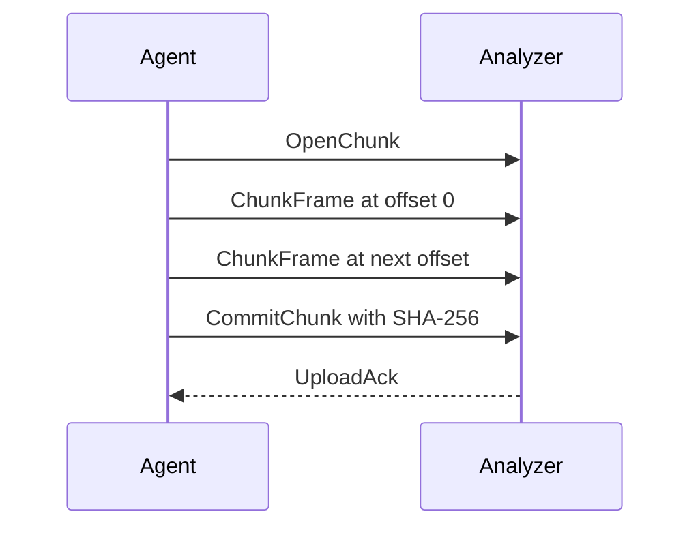

The Jafra Agent and Analyzer communicate through a bidirectional gRPC
protocol. Both components generate their bindings from the shared
`contracts/jafra.proto` definition.

## Upload lifecycle

`JafraIngestService.Upload` is a bidirectional streaming RPC:



`OpenChunk` identifies the cluster, namespace, pod, container, recording,
physical file, chunk offset, chunk length, and protocol version. Version `1`
is required.

Frames must be contiguous and ordered. The analyzer rejects gaps, overlaps,
invalid metadata, unsupported protocol versions, and checksum mismatches.

## Acknowledgements

- `ACCEPTED` — checksum matched and durable chunk metadata was written.
- `DUPLICATE` — the same deterministic chunk ID is already durable.
- `RETRY` — the request may succeed later, for example after a transient
  resource condition.
- `REJECTED` — permanent protocol or data failure; the agent retains the
  source recording.

The agent treats `ACCEPTED` and `DUPLICATE` as durable acknowledgement.
`RETRY` uses bounded exponential backoff.

## Identity

The recording identity is:

```text
<clusterId>/<podUID>/<container>/<filename>
```

The chunk ID is a SHA-256 hexadecimal digest over the cluster ID, pod UID,
container, filename, chunk offset, and chunk length. Namespace and pod name
remain query metadata; pod UID provides workload-instance uniqueness.

The default frame size is 131072 bytes (128 KiB).
