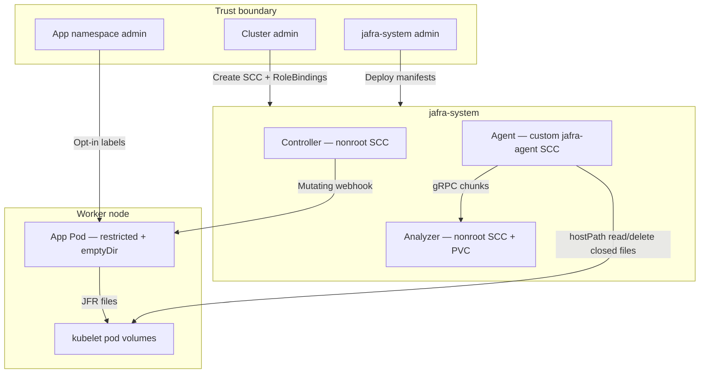

This page explains **why** Jafra needs OpenShift Security Context Constraints
(SCCs), **what** each component is allowed to do, and **what stays restricted**.
Read it together with [Install on OpenShift](./openshift-install.md).

## Short answer

| Question | Answer |
| --- | --- |
| Do opted-in Java apps need a custom SCC? | **No.** They use `emptyDir` and default / restricted policies. |
| Does the analyzer need hostPath? | **No.** It uses a PVC and runs under the built-in `nonroot` SCC. |
| Does the controller need hostPath? | **No.** Webhook + injection only; `nonroot` SCC. |
| What needs elevation? | **Only `jafra-agent`**, via a **minimal custom SCC** named `jafra-agent`. |
| Why? | The agent must read (and delete) JFR files from **other Pods'** emptyDir volumes under the kubelet path. |

## Why the agent needs special access

On OpenShift, each Pod’s volumes are isolated by SELinux Multi-Category
Security (MCS). An `emptyDir` that looks like `/jfr-data` inside the app
container lives on the node as something like:

```text
/var/lib/kubelet/pods/<pod-uid>/volumes/kubernetes.io~empty-dir/jafra-recordings/...
```

The Jafra Agent is a **DaemonSet outside the application Pod**. To discover
finalized chunks and delete closed rotations after durable acknowledgement, it
must:

1. Mount the kubelet pods root (`hostPath` → `/var/lib/kubelet/pods`).
2. Read across MCS categories of other Pods’ emptyDirs (SELinux type
   `spc_t` on the agent container, as requested by the DaemonSet).

That combination is **not** allowed under `restricted` or `nonroot`. Jafra
therefore ships a dedicated SCC instead of granting `privileged`.

## What an SCC is (OpenShift primer)

A **Security Context Constraint** is an OpenShift admission policy that limits
what a Pod’s security context may request: hostPath, privileged mode, host
network, which user IDs, SELinux options, and so on.

- Built-in SCCs (examples): `restricted`, `nonroot`, `anyuid`, `privileged`.
- OpenShift auto-creates ClusterRoles named
  `system:openshift:scc:<scc-name>` for **built-in** SCCs so ServiceAccounts
  can be bound with `use`.
- **Custom SCCs** do **not** get that ClusterRole automatically. Jafra’s
  [`scc-jafra-agent.yaml`](https://github.com/bharathappali/jafra-io/blob/dev/deploy/openshift/scc-jafra-agent.yaml)
  therefore defines both the SCC and
  `system:openshift:scc:jafra-agent`.

Binding is namespaced: RoleBindings in `jafra-system` grant specific
ServiceAccounts permission to **use** an SCC. Creating or changing SCCs is
cluster-scoped and normally requires cluster-admin.

## SCC map for Jafra v0.0.2

| Component | ServiceAccount | SCC | Why |
| --- | --- | --- | --- |
| `jafra-agent` | `jafra-agent` | **`jafra-agent` (custom)** | hostPath to kubelet volumes; SELinux `RunAsAny` so `spc_t` can be set; not privileged |
| `jafra-controller` | `jafra-controller` | **`nonroot`** | Fixed non-root UID; no hostPath |
| `jafra-analyzer` | `default` (in `jafra-system`) | **`nonroot`** | PVC only; no hostPath |
| Opted-in app Pods | app’s own SA | **default / restricted** | Injected `emptyDir` `jafra-recordings` only |

Manifest source:
[`deploy/openshift/scc-platform.yaml`](https://github.com/bharathappali/jafra-io/blob/dev/deploy/openshift/scc-platform.yaml).

## What the custom `jafra-agent` SCC allows and denies

**Allowed (minimal for the job):**

- `hostPath` volumes (for `/var/lib/kubelet/pods` only in practice — the
  DaemonSet mounts that path)
- Common pod volumes: `configMap`, `secret`, `emptyDir`, `projected`, …
- `runAsUser` / `fsGroup` / `supplementalGroups` / `seLinuxContext`: `RunAsAny`
  (needed so the DaemonSet can request `spc_t` and run as configured)
- `seccompProfiles: runtime/default`
- `priority: 10` so admission prefers this SCC when the SA is bound to it

**Explicitly denied / not granted:**

- `allowPrivilegedContainer: false`
- `allowPrivilegeEscalation: false`
- `allowHostNetwork: false`
- `allowHostPID: false`
- `allowHostIPC: false`
- `allowHostPorts: false`
- `requiredDropCapabilities: [ALL]`
- `allowedCapabilities: null` (no added capabilities)

So the agent is **not** a privileged Pod. It is a narrowly elevated collector
with hostPath + flexible SELinux, which is still a meaningful trust decision:
anyone who can run workloads as the `jafra-agent` ServiceAccount in
`jafra-system` can read kubelet-visible pod volume data on that node.

## Permission roles (who must do what)

### Cluster admin (or equivalent)

Needed to:

- Create `SecurityContextConstraints` `jafra-agent`
- Create ClusterRole `system:openshift:scc:jafra-agent`
- Create RoleBindings that reference SCC ClusterRoles in `jafra-system`
- Create cluster-scoped `MutatingWebhookConfiguration`
- Install cert-manager cluster-wide (optional but usual)

One-shot apply:

```bash
kubectl apply -f deploy/controller/namespace.yaml
kubectl apply -f deploy/openshift/scc-jafra-agent.yaml
kubectl apply -f deploy/openshift/scc-platform.yaml
```

### Namespace admin for `jafra-system`

After SCC bindings exist, can deploy/update platform workloads:

- Deployments, DaemonSet, Services, PVC
- ServiceAccounts and Secrets
- cert-manager `Issuer` / `Certificate` in the namespace

### Workload namespace admin

- Label/annotate Pod templates for opt-in
- **No** Jafra SCC bind in the app namespace
- Must accept the webhook’s injected shape (`emptyDir`, init container,
  `/jfr-data` mount, `JAVA_TOOL_OPTIONS`)

## Security model (clear picture)



**Data sensitivity**

- The agent can observe JFR content for opted-in workloads on the node
  (CPU samples, allocations, sometimes application strings in events). Treat
  `jafra-system` and the agent SA as **sensitive**.
- The analyzer PVC holds durable chunks. Protect the PVC and HTTP/gRPC
  exposure with normal cluster network policy and RBAC.
- Controllers never receive recording bytes; they only mutate Pod specs at
  create time.

**What Jafra does not require**

- Privileged SCC
- Host network / host PID / host IPC
- Custom SCC on application namespaces
- hostPath on application Pods (v0.0.2 uses emptyDir)

**Operational hardening tips**

- Limit who can edit RoleBindings in `jafra-system` or impersonate
  `jafra-agent`.
- Keep the agent DaemonSet on Linux worker nodes only (as shipped).
- Prefer registry pull with pull secrets over cluster-wide privileged pullers.
- Use NetworkPolicies if your platform requires isolating `jafra-system`.
- Tear down with `./install-jafra.sh --target openshift --teardown` when
  decommissioning; remove custom SCC manually if you no longer need it:

```bash
kubectl delete scc jafra-agent --ignore-not-found
kubectl delete clusterrole system:openshift:scc:jafra-agent --ignore-not-found
```

## Troubleshooting SCC admission

```bash
oc describe pod <name> -n jafra-system
oc get rolebinding -n jafra-system -l app.kubernetes.io/part-of=jafra
oc get scc jafra-agent -o yaml
```

Common failures:

- SCC or ClusterRole missing → apply `scc-jafra-agent.yaml`
- RoleBinding missing → apply `scc-platform.yaml` after the namespace exists
- App Pod rejected → usually webhook/config issues or policy forbidding the
  injected init/emptyDir shape, **not** a missing app SCC

Webhook creation permission:

```bash
kubectl auth can-i create mutatingwebhookconfigurations --all-namespaces
```

## Related docs

- [Install on OpenShift](./openshift-install.md)
- [Recording storage and durability](../concepts/storage-and-durability.md)
- [Jafra Agent reference](../reference/agent.md)
- Upstream notes in the umbrella repo:
  [`deploy/openshift/README.md`](https://github.com/bharathappali/jafra-io/blob/dev/deploy/openshift/README.md)
