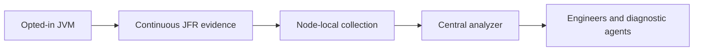

<div className="release-scope">
You are viewing the documentation for Jafra v0.0.2. This release supports
Kubernetes (including Kind) and OpenShift. Start with
[Install Jafra on Kind](getting-started/quick-start.md) or
[Install Jafra on OpenShift](getting-started/openshift-quick-start.md). For
SCC details, see [OpenShift security and SCCs](deploy/openshift-security.md).
</div>

JAFRA—**JVM Advanced Flight Recording with Async-profiler**—automates flight
recording and analysis for Java workloads in Kubernetes. async-profiler
performs the profiling; JAFRA injects it into selected containers, manages the
recording flow, and analyzes the resulting JFR data with JDK Mission Control
rules.

The result is a continuous JVM evidence pipeline that preserves runtime
context from before, during, and after a performance symptom, ready for
engineers and diagnostic agents when they need it.

## The missing evidence problem

Imagine a Java service with a new feature. Every functional test passes. Under
production-like release traffic, however, p99 latency rises alongside CPU,
heap activity, and garbage collection.

The dashboard proves that something changed, but it does not show what was
happening inside the JVM. An engineer or RCA agent can inspect metrics, logs,
and deployment metadata, yet still lack the runtime evidence needed to
correlate allocations, GC activity, locks, and CPU samples.

Starting JFR or attaching a profiler at that point is useful for what happens
next, but it cannot recover events from before recording began. If the
important spike has already passed, the investigation may require collecting
files manually or rerunning the workload and hoping the behavior repeats.

## Collect first. Analyze when needed.

Jafra changes the order of the investigation. Instead of starting collection
after a symptom appears, you opt a workload into continuous recording before
the test or incident:

```yaml
metadata:
  labels:
    jafra.io/enabled: "true"
    jafra.io/mode: "continuous"
  annotations:
    jafra.io/containers: "fare-quote"
```

When Kubernetes creates the next Pod, JAFRA injects async-profiler.
async-profiler starts rotating JFR data from JVM startup; JAFRA then collects
and analyzes those recordings. No application image rebuild or source change
is required.



When latency rises, the relevant recording window already exists. You can ask
for the last five minutes and inspect aligned allocation, GC, CPU, lock, and
JVM events without searching nodes for files.

## From symptoms to shared context

The Jafra Analyzer provides two complementary outputs:

- **Reports** apply JDK Mission Control rules to recording data and return
  scored findings by topic.
- **Event summaries** expose the event types and measurements present in the
  selected recording window.

These outputs give engineers and AI diagnosis agents the same runtime context.
They can correlate a latency spike with allocation or GC pressure, reduce
blind reruns, and reach useful evidence sooner.

Jafra does not claim to find a guaranteed root cause or repair an application.
It supplies the missing JVM evidence; humans and diagnostic agents interpret
that evidence.

## The product components

- **Jafra Controller** enrolls selected containers when Kubernetes creates a
  Pod. It injects async-profiler and prepares recording identity and storage
  (`emptyDir` volume `jafra-recordings`).
- **Jafra Agent** runs on every node, discovers finalized JFR chunks under the
  kubelet emptyDir path, and sends them to the central service.
- **Jafra Analyzer** validates and stores durable chunks, stitches recordings
  on demand into a bounded cache, and serves time-window reports and event
  summaries.

Continue with [How Jafra works](concepts/architecture.md), or review the
[prerequisites](getting-started/requirements.md) and install on
[Kind](getting-started/quick-start.md) or
[OpenShift](getting-started/openshift-quick-start.md).
