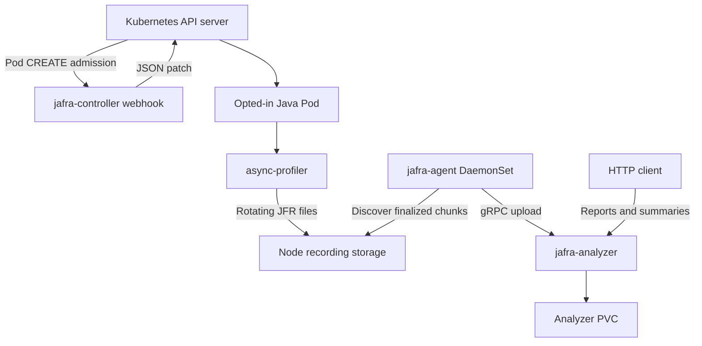

import architectureImage from '../../../assets/imgs/jafra_v001_arch_n_flow.png';

Jafra coordinates three distinct responsibilities: async-profiler records JVM
events, node-local Agents collect completed JFR chunks, and the Analyzer
applies JDK Mission Control rules. Application teams get continuous evidence
without packaging recording infrastructure into every service.

<figure className="architecture-visual">
  
  <figcaption>JAFRA v0.0.1 architecture and recording flow</figcaption>
</figure>



## 1. Opt in a workload

You select a Java workload using labels and annotations on its Pod template.
When Kubernetes creates the Pod, the Jafra Controller validates that
configuration and adds everything async-profiler needs to start recording:

- an init container carrying async-profiler v4.5;
- an `emptyDir` for `libasyncProfiler.so`;
- a node `hostPath` rooted at `/var/lib/jafra/recordings`;
- a per-container `/jfr-data` mount;
- downward-API identity variables;
- an async-profiler `-agentpath` option in `JAVA_TOOL_OPTIONS`.

The workload image is not modified. The profiler is prepared by an init
container and loaded through `JAVA_TOOL_OPTIONS` when the JVM starts.

For each selected container, the controller creates:

```text
<namespace>/<podUID>/<container>/
```

under the node recording root. The application sees this location as
`/jfr-data` and writes rotating `profile-N.jfr` files. Identity metadata
stored beside the files preserves the namespace, Pod, and container that
produced them.

## 2. Collect complete recording chunks

One Jafra Agent runs on each Linux node. It watches the shared recording tree
and parses JFR headers to determine when a chunk is complete. It does not
assume that a filesystem notification means the JVM has finished writing.

Chunks from different recordings can upload concurrently, while chunks from
the same file remain ordered. Periodic rescans make collection resilient to
missed or bursty filesystem events.

## 3. Store recordings centrally

The agent streams each chunk to the Jafra Analyzer over gRPC. The analyzer
validates the upload sequence and SHA-256 checksum before acknowledging it.
Retries are safe because every chunk has a deterministic identity and an
already stored chunk is recognized as a duplicate.

Accepted chunks are stored on the analyzer PVC. Contiguous chunks are
reconstructed into recordings that can be queried by namespace, Pod, and
container.

## 4. Turn recordings into operational evidence

The Analyzer HTTP API supports two complementary views:

- **Automated reports** run JDK Mission Control rules and return scored
  findings by topic.
- **Event summaries** aggregate the raw event types present in a recording,
  including useful numeric and text fields.

Both views can target a recording or a time window, making them suitable for
incident investigation and repeatable operational tooling.

## Reliability model

- A source rotation remains on its node until every complete chunk is
  acknowledged and a newer rotation exists.
- Agent restarts can cause a retry, but durable analyzer identities prevent a
  duplicate recording from being stored.
- Analyzer recovery removes incomplete transfers, reloads committed chunk
  metadata, and rebuilds recordings.
- In v0.0.1, analyzer durability is provided by a single ReadWriteOnce PVC.
